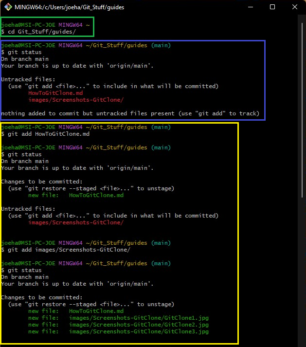
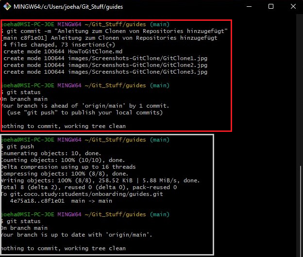

# How to - git add, commit & push

Ok du hast dir ein Repository erstellt oder zuvor gecloned, hast nun irgendetwas geändert und willst es nun quasi "hochladen".
Bei uns nennen wir das pushen!

## Schauen wir uns ein Beispiel an

Ich habe gerade ein Tutorial zum Thema Git Clone erstellt und will das nun in unser Repository hochladen.

1. Ich öffne die GitBash *(Windows)* bzw. das Terminal *(Mac)*.

2. Mit `cd` navigiere ich mich in den Ordner vom Repository. *(Grün)*
   
   z.B.: `cd Git_Stuff\guides`  
   `Git_Stuff\guides` *ist hierbei der Name des Pfades. Dein Pfad lautet wahrscheinlich anders!*

3. Mit `git status` frage ich den derzeitigen Status ab. *(Blau)*
   Dabei sehe ich, dass ich *"Untracked files"* habe und mit wird sogar vorgeschlagen diese mit `git add` hinzuzufügen.

4. Ich füge die Datei `HowToGitClone.md` mit `git add` hinzu. *(Gelb)*
   Anschließend frage ich erneut den Status ab, dieses ist aber **nicht notwendig** sondern hier nur zur Demonstration! 
   
   - Mir wird die `HowToGitClone.md` unter *"Changes to be committed"* angezeigt.
   
   - Als nächstes füge ich noch mit `git add` den Ordner `Screenshots-GitClone` hinzu.
   
   - Anschließend frage ich erneut den Status ab und sehe, dass nun alle Dateien hinzugefügt sind.

5. `git commit -m "..."` *(Rot)*
   
   - Jeder Commit wird mit einer Nachricht versehen. Gerade wenn mehrere Leute zusammenarbeiten, kann es sinnvoll sein kurz zu beschreiben, was man überhaupt geändert hat. In meinem Fall habe ich eine Anleitung zum Clonen von Repositories hinzugefügt.
   
   - das `-m` steht hierbei übrigens für *Message*
   
   - Anschließend habe ich erneut zur Demonstration `git staus` ausgeführt.
   Wir sehen nun das alle lokalen Änderungen dem lokalen Repository hinzugefügt und mit einer Nachricht versehen wurden.  

6. `git push` sorgt nun dafür, dass unsere Änderungen hochgeladen werden. *(Grau)*
