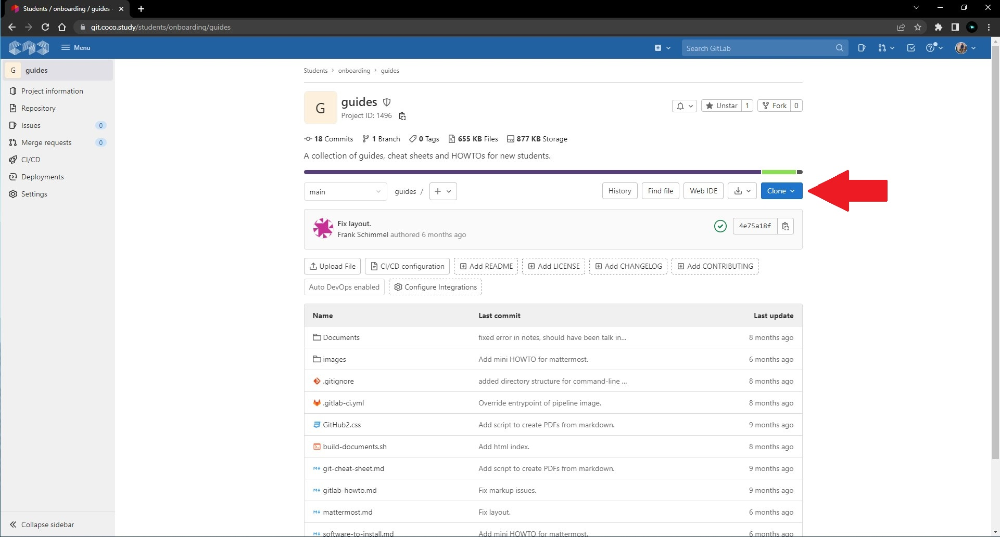
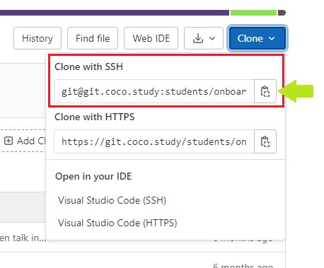
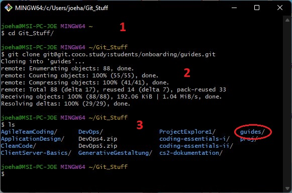

# How To - git clone

Du hast ein Repository online, wahrscheinlich von deinem aktuellen Kurs.
Dir wurde gesagt *"Cloned euch das mal"* und du fragst dich jetzt wie? 
Ja dann...

## Was brauchst du?

Zunächst einmal brauchst du ein Konto auf dem [CoCo GitLab](https://git.coco.study/) und einen funktionierenden SSH Key für deinen PC oder Laptop.
_[SSH was?](ssh-keys-gitlab-howto.md)_

Als Windows-User ist es am einfachsten die GitBash zu verwenden.
Als Mac-User nutzt du einfach das Terminal.

## Was macht git clone eigentlich?

Git Clone downloaded dir das Repository auf deinen PC / Laptop.
Dann hast du es lokal auf deinem Gerät und kannst die Dateien, die bereits im Repository vorhanden sind bearbeiten, neue hinzufügen oder löschen.

## Ok und wie mache ich das jetzt?

1. Geh auf die GitLab Seite von dem Repository, welches du clonen möchtest.
   Das sieht dann ungefähr so aus:
   

2. Rechts siehst du schon den blauen Button der mit der Inschrift *"Clone"*.
   Da klickst du drauf.

3. nun öffnet sich ein Untermenü: 
   

   Da du einen SSH-Key hast, ist die Option *"Clone with SSH"* die Richtige.
   Nun musst du den Link kopieren. Am einfachsten geht das, indem du den Button rechts neben dem Link klickst.

4. Öffne nun dein Terminal (Mac) bzw die GitBash (Windows).

5. Navigiere in den Ordner, indem du das Repository haben möchtest.
   z.B.: `cd Git_Stuff`
   `Git_Stuff` *ist hierbei der Ordnername. Heißt dein Ordner anders, musst du hinter* `cd` *den Namen **deines** Ordners eingeben!*

6. Bist du im Ordner deiner Wahl?
   Dann führe nun folgenden Befehl aus: 
   `git clone <Was du in Schritt 3 kopiert hast>`

7. **Optional**
   Wenn du ein Passwort für deinen SSH Key eingerichtet hast, wirst du noch dach dem Passwort gefragt.
   Das musst du dann eingeben. Während du es eingibst, kann es sein, dass du nicht siehst, dass du was eingibst. Es wird nicht im Terminal oder der GitBash sichtbar sein! Du musst es also blind eingeben und deine Eingabe dann mit Enter bestätigen.

8. **Wuhuuu! Fertig! :)**

### Im Ganzen sollte es in der GitBash bzw. im Terminal etwa so ausgesehen haben:

1.  `cd Git_Stuff` 
    So habe ich in den Ordner `Git_Stuff`navigiert.

2. `git clone git@git.coco.study...` 
   Da ich nun in meinem Zielordner bin, habe ich den Befehl `git clone` mit der Adresse vom Repository eingegeben.
   Ich habe kein Passwort für meinen SSH Key, also wurde ich auch nicht danach gefragt.
   Darunter sieht man nun, das was gedownloaded wurde.
   Die letzte Zeile aus dem Block `Resolving deltas: 100% (29/29), done.` zeigt mir, dass es fertig, und da 29 von 29 Objekten übertragen wurden, auch vollständig ist.

3. `ls` 
   Es werden mir alle Ordner und Dateien aufgelistet, die bei mir im Ordner `Git_Stuff`zu finden sind.
   Neu ist der Ordner `guides`.
   Das ist das Repository, welches ich gerade gecloned habe. 
