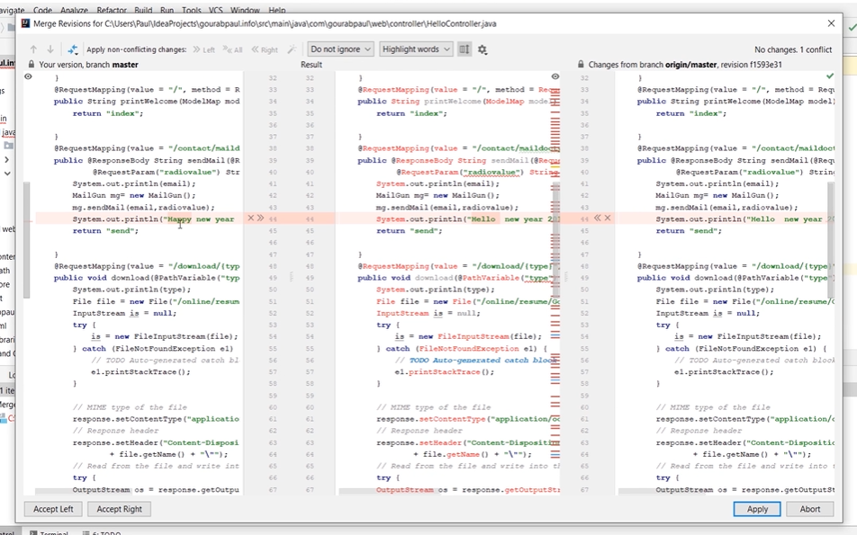

# How to - Merge

## Was ist eigentlich Merge

Programmieren ist ein Teamsport, daher kommt es häufig vor, dass du in einem Team an einem gemeinsammen Projekt arbeitest. Allerdings Programmiert man nicht immer zusammen, sondern man teilt sich auch öfter auf verschiedene Aufgaben auf. Wie man trozdem im gleichen Code agieren kann ist dank Merge möglich.
Merge ist quasi das verschmelzen deines Codes mit dem deines Teams, so werden Änderungen von dir als auch von deinem Team in einen Code vereinigt, der danach als weitere Codebasis fungiert.

## Merge im Beispiel erklärt

Du hast gerade einen Fehler im bisherigem Programm behoben, während der Rest deines Teams den Code z.B. um eine Methode erweitert hat.
Jetzt hat dein Team einen anderen Code zur Grundlage als du (dir fehlt die von ihnen Programmierte Methode), also was nun?

1. Als erstes sollte dein Team ihren jetzigen stand commiten und pushen _(bei Unsicherheit auch gerne nochmal [hier](HowToGitAddCommitPush.md)schauen)_

2. Nun kannst du dir den aktuellen Stand des Team pullen (Also "herunterladen")
   
3. Jetzt kannst du mit Rechtsklick auf den aktuellsten Stand des Codes (der, der gerade von deinem Team gepusht wurde) ein Drop-Down-Menü aufmachen.
   

   
4. Falls du und dein Team nicht am gleichen Stueck Code etwas geändert habt, bist du jetzt schon fertig mit dem Mergen und kannst zu Schritt 7 im Tutorial springen. 
Falls allerdings ein ähnliches Fenster wie folgendes auftaucht, habt ihr einen so genannten Merge Konflikt, den ihr erstmal beheben müsst bevor ihr weiter machen könnt: 

1. Da dein Programm bemerkt, dass dein aktueller Code anders ist als der deines Teams wird eine merge request gestellt _(also eine Anfrage deinen Code mit dem deines Teams zu verschmelzen)_ 
Dafür gibt dir Intelij auch schon Vorlagen für das Endprodukt.

6. Nun suchst du das Endprodukt, was sowohl deine Änderung, als auch die Erweiterung deines Teams beinhaltet und wählst diese als Endprodukt des Merges aus. 
_(Änderungen im Code sind farblich markiert)_

7. Nach dem fertigem Merge, solltest du nun den gemergeten Code commiten und pushen.
Nun kann dein Team den Code nochmal pullen. So haben alle im Team den gleichen Code als Basis für das weitere Programmieren.
                                            