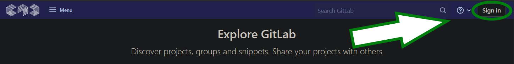
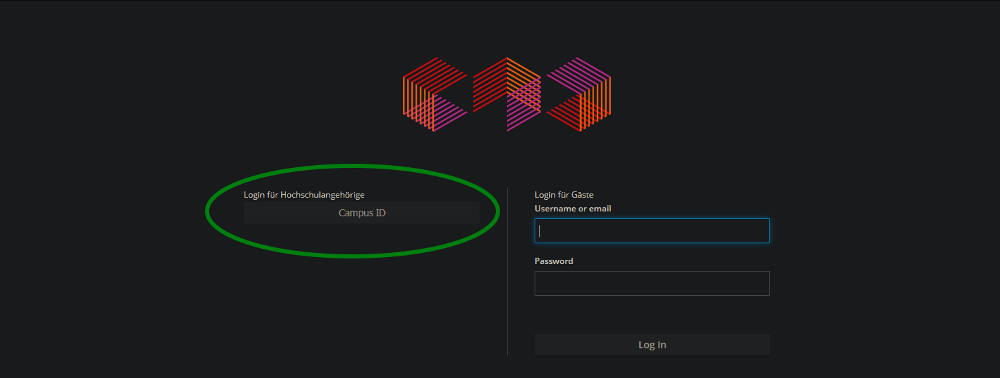
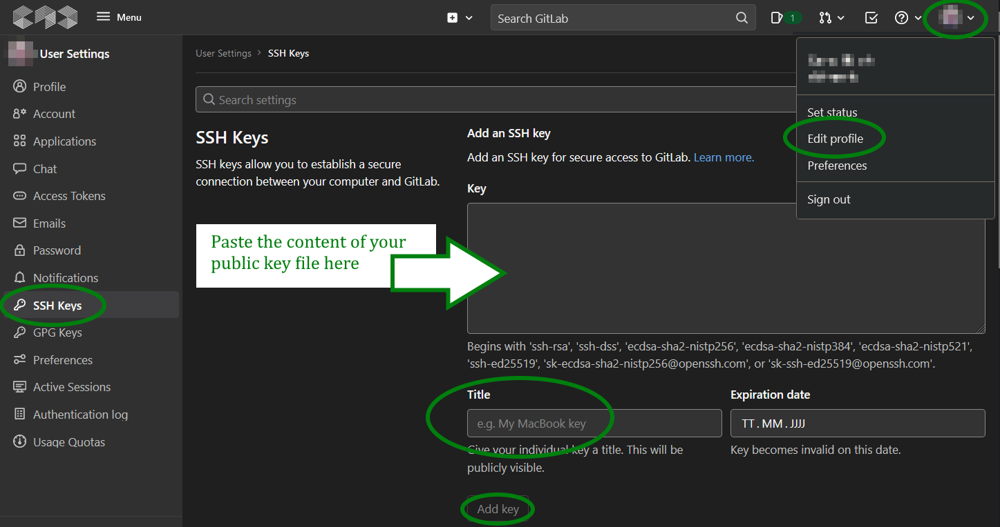

# Code & Context -- GitLab + SSH Keys Howto

Some general info on GitLab and SSH
-----------------------

### &hearts; What is GitLab and why do I need SSH keys?

GitLab is a web-based platform you will use to manage and share all your coding projects (as git repositories). To use GitLab, you'll need an SSH key pair for authentication. In this guide, we'll show you how to generate an SSH key pair and add them to your GitLab account. 

FAIR WARNING: You will be using a terminal for some steps, which might seem outdated and unnecessarily complicated at first. But don't worry: Once you get used to the crusty look and feel, using the terminal is pretty easy -- and it's actually an important part of everyday, modern IT work, especially when dealing with Linux environments, which WILL happen during your studies. 

### &hearts;  What is SSH and what are SSH Keys?

In short, SSH is an authentication protocol enabling secure, encrypted communication and file transfers via (unsecure) network connections. The basic concept is that there are two SSH keys: a public key and a private key. You enter the public key in your GitLab profile and authentication then only works if you also have the corresponding private key (which only you know!) on your PC/laptop.

Generate Your SSH Key
---------------------

If you already have an SSH key, you can use that or create a new one for CoCo. Please note that there are some restrictions concerning the name and format of SSH keys in GitLab. See the [GitLab SSH doc for more info](https://git.coco.study/help/ssh/index)

If you don't already have a key, you'll have to create a new one. 

### &hearts; Check if you already have an SSH key

Your keys should be in the following directory:
**MacOS/Linux**: `~/.ssh`, or `/Users/<yourUsername>/.ssh`
**Windows**: `c:/Users/<yourUsername>/.ssh`

The period (.) in front of '.ssh' means that the folder is hidden by default. If you can't see your `.ssh` folder (and other hidden folders and files) you might have to set up your Operating System (Windows/Mac/Linux) to display hidden and system files. To do that, follow these instructions: [Windows](https://support.microsoft.com/en-us/windows/view-hidden-files-and-folders-in-windows-97fbc472-c603-9d90-91d0-1166d1d9f4b5#WindowsVersion=Windows_11) | [Mac](https://www.heise.de/tipps-tricks/Mac-Versteckte-Dateien-anzeigen-3981907.html) | [Linux](https://wiki.ubuntuusers.de/Versteckte_Dateien/)

If you still can't see your `.ssh` folder after displaying hidden files, you might simply not have used SSH before. During the next steps the `.ssh` folder should be created for you; or you can create it manually.

### &hearts; Install software to create a new SSH key 

Under Mac and Linux, you're all set and ready to go.

Under Windows, you might have to install/enable some extra tool(s):

* While it's possible to generate SSH keys under Windows 10/11 without any third-party software ([see here](https://docs.microsoft.com/de-de/windows-server/administration/openssh/openssh_keymanagement)), the easiest way is probably to just use the Git Bash for Windows. Git Bash is included when installing [Git for Windows](https://git-scm.com/download/win), which is recommended anyway. 

### &hearts; Create a new SSH key

* MacOS/Linux: open a Terminal Window ([Manual for Mac](https://support.apple.com/de-de/guide/terminal/apd5265185d-f365-44cb-8b09-71a064a42125/mac) | [Manual for Linux/Ubuntu](https://itsfoss.com/open-terminal-ubuntu/))
* Windows: Open Git Bash
* Enter the following command: `ssh-keygen -t ed25519 -C '<yourEmailName>@smail.th-koeln.de'`

* You will be asked for the "file in which to save the key" with a default file in brackets (e.g. `/c/users/<yourUsername>/.ssh/id_ed25519`). 
* If you already have an SHH key with the same name, input a new, unique filename (e.g. `/c/users/<yourUsername>/.ssh/id_ed25519_new`). Otherwise you will be prompted if you want to overwrite your existing key file.
* **Unless you really know what you are doing, it is highly recommended to use the default `.ssh` folder!**
* Confirm by pressing "Enter"

* Next you will be asked for a passphrase. Enter a good one, then confirm it. Remember it well, you will need it!

You now should have generated two files in `.ssh`:
<ul>
<li>id_ed25519.pub contains the public key</li>
<li>id_ed25519 contains the private key</li>
</ul>
<mark>!! IMPORTANT:</mark> Your private key is a secret! Never enter it anywhere. Never upload it anywhere. Never paste it into a website.

Add Your Key To Your GitLab Profile
-----------------------------------

* Open <https://git.coco.study/> in a browser
* Click the "Sign in"  button in the upper right corner
  

* Click the "CampusID" button
  

* Go to the [user settings > SSH Keys](https://git.coco.study/-/profile/keys) section in GitLab 
    * Click the icon in the upper right corner
    * Click "Edit profile"
    * Click "SSH keys" in the menu on the left

* Display your _public_ key using `cat ~/.ssh/id_ed25519.pub`
* Now find out how to select and copy text in whatever terminal/bash you're using. Then copy your public key.
* Enter your public key in your GitLab profile
* Enter a good title so that you can tell keys apart. Maybe add the name of the computer the key is on in the title. You might add more keys later...
* Leave the expiration date blank
* Click "Add key"
  

### &hearts; Verify Your Configuration

* Run the command `ssh -T git@git.coco.study`

* The first time you connect, you will be asked to verify the authenticity of the CoCo GitLab server:

    * `The authenticity of host 'git.coco.study (139.6.56.101)' can't be established.
    ECDSA key fingerprint is SHA256:HlyQ4JrVtPgGxQJjSUhjPCE2Vk6ieuqbIEJ51zqUAPg.
    Are you sure you want to continue connecting (yes/no/[fingerprint])?`

* Answer 'yes'

* You should get a message like this: `Welcome to GitLab, @<your-campusID>`

* For troubleshooting, run this command: `ssh -Tvvv git@git.coco.study`

* Try to make sense of the output and to figure out what's wrong. If that does not work, cry for help.

[ [for all technical details see the GitLab SSH doc](https://git.coco.study/help/ssh/index) ]

